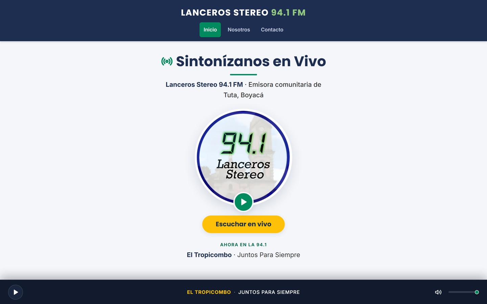
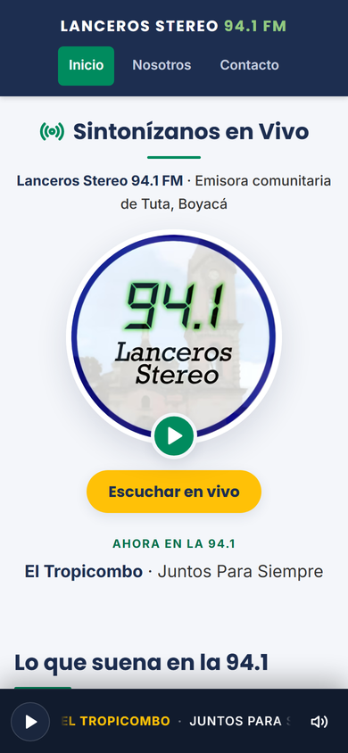
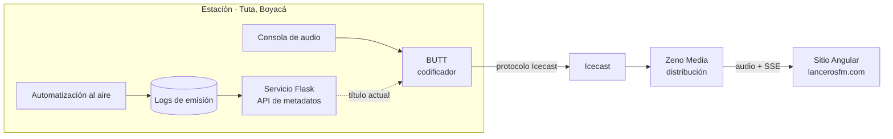

<div align="center">


# Lanceros Stereo 94.1 FM

**Sitio oficial de la emisora comunitaria de Tuta, Boyacá.**

Reproductor en vivo, canción al aire en tiempo real y contenido de la emisora, en una aplicación Angular prerenderizada y sin backend propio.

<br/>

[](https://angular.dev/)
[](https://www.typescriptlang.org/)
[](https://vercel.com/)

**[lancerosfm.com](https://lancerosfm.com/)**

</div>

---

## Sobre el proyecto

Lanceros Stereo 94.1 FM transmite desde Tuta, Boyacá. Este sitio es el punto de acceso para quien escucha fuera del alcance de la señal FM: familiares en otras ciudades, migrantes del municipio y oyentes que sintonizan desde el celular.

Dos decisiones ordenan todo lo demás:

1. **El reproductor es lo primero que se ve.** Buena parte de la audiencia es gente mayor que entra a escuchar, no a navegar. La portada abre con el botón de reproducir a la vista y la barra del reproductor vive fuera del enrutador, así que la música no se corta al cambiar de página.
2. **El contenido se prerenderiza.** Cada ruta se genera como HTML completo en el build: los buscadores reciben el texto sin ejecutar JavaScript y el navegador pinta antes de descargar la aplicación.

<div align="center">

<br/><br/>

</div>

### Secciones

| Ruta             | Contenido                                                      |
| ---------------- | -------------------------------------------------------------- |
| `/`              | Reproductor, canción al aire y accesos rápidos                 |
| `/nosotros`      | La emisora, el municipio, la cadena de transmisión y el equipo |
| `/como-escuchar` | Formas de sintonizar y preguntas frecuentes                    |
| `/contacto`      | WhatsApp, teléfono, correo, dirección y redes                  |

El menú muestra **Inicio, Nosotros y Contacto**; «Cómo escucharnos» se enlaza desde la portada y el pie.

---

## Cadena de transmisión



El punto no trivial es la sincronización: audio y título viajan por rutas distintas, y que el oyente vea el nombre correcto mientras suena la canción correcta depende de que el metadato se inyecte al codificar y no después.

---

## Características

|                               |                                                                                                                                                        |
| ----------------------------- | ------------------------------------------------------------------------------------------------------------------------------------------------------ |
| **Transmisión en vivo**       | Máquina de estados explícita (`stopped` · `loading` · `playing` · `reconnecting` · `error`) expuesta como señales.                                     |
| **Reconexión automática**     | Reintentos con espera creciente. Al pausar se libera la fuente, así al reanudar suena el directo y no el audio viejo del buffer.                       |
| **Qué suena ahora**           | El título llega por Server-Sent Events y se ve en la portada y en la barra. En pantallas estrechas se desplaza en bucle para poder leerlo completo.    |
| **Pantalla de bloqueo**       | MediaSession API: título, artista, carátula y controles fuera del navegador.                                                                           |
| **Instalable y sin conexión** | Service worker con política de actualización propia. La segunda visita abre sin tocar la red.                                                          |
| **Posicionamiento**           | Prerender estático, metadatos por ruta sin duplicados, datos estructurados `RadioStation`, `FAQPage` y `BreadcrumbList`, `sitemap.xml` y `robots.txt`. |
| **Accesibilidad**             | Un `<h1>` por página, foco visible, salto al contenido, `aria-live` en los cambios de canción y respeto por `prefers-reduced-motion`.                  |
| **Seguridad**                 | CSP, `nosniff`, `Referrer-Policy`, `Permissions-Policy`, `frame-ancestors 'none'` y HSTS, declaradas en `vercel.json`.                                 |

---

## Arquitectura

Sigue la [guía de estilo oficial de Angular](https://angular.dev/style-guide): el código se agrupa por **área funcional** y no por tipo de archivo, así que no hay carpetas `components/`, `services/` ni `models/`.

```
src/
├── main.ts                     Arranque en el navegador
├── main.server.ts              Arranque del prerender
├── index.html
├── styles.scss                 Reset y base global
├── styles/
│   ├── _tokens.scss            Paleta institucional, tipografía y espaciado
│   ├── _fonts.scss             Tipografías auto-hospedadas
│   └── _ui.scss                Piezas compartidas: botones, tarjetas, secciones
└── app/
    ├── app.ts                  Raíz: cabecera, rutas, pie y reproductor
    ├── app.config.ts           Enrutador, hidratación y service worker
    ├── app.routes.ts           Rutas del navegador
    ├── app.routes.server.ts    Qué se prerenderiza
    │
    ├── station/                La emisora
    │   ├── station.ts          Datos, contacto, redes y URLs del stream
    │   └── team.ts             Equipo de locución
    │
    ├── player/                 Reproducción
    │   ├── radio-player.ts     Audio, reconexión, metadatos y MediaSession
    │   ├── track.ts            Estado y lectura del título al aire
    │   └── player-bar/         Barra fija inferior
    │
    ├── seo/                    Posicionamiento
    │   ├── page-metadata.ts    Título, descripción, canónico y etiquetas sociales
    │   └── structured-data.ts  Esquemas JSON-LD
    │
    ├── pwa/
    │   └── app-updates.ts      Política de actualización del service worker
    │
    ├── toasts/                 Avisos
    │   ├── toast-queue.ts      Cola con temporizador por aviso
    │   └── toast-list/         Presentación
    │
    ├── layout/                 Estructura común
    │   ├── site-header/
    │   ├── site-footer/
    │   ├── floating-contact/
    │   └── page-header/
    │
    └── pages/                  Una carpeta por ruta
        ├── home/
        ├── about/
        ├── how-to-listen/
        ├── contact/
        └── not-found/
```

### Convenciones

- **Nombres sin sufijo**, como genera Angular 22: `radio-player.ts` exporta `RadioPlayer`, y cada componente reúne su `.ts`, `.html` y `.scss` en su carpeta.
- **Código en inglés; contenido en español.** Clases, variables, clases CSS e ids van en inglés. Las URL, los textos, los comentarios y las descripciones de las pruebas van en español, porque los leen la audiencia y quienes mantienen el sitio.
- **`protected`** en lo que solo usa la plantilla, y la propiedad **`host`** en lugar de `@HostListener`.
- **Señales** para el estado, **`inject()`** para las dependencias y **detección de cambios sin zone.js**, que es el comportamiento por defecto de Angular 22.
- **Modo estricto** de TypeScript y de plantillas.

`RadioPlayer` es el único punto que toca el elemento de audio y `PageMetadata` el único que escribe en `<head>`.

---

## Sin conexión y actualizaciones

La política vive en `app-updates.ts` y tiene tres reglas:

1. **Nunca mientras suena la emisora.** Recargar corta el audio.
2. **Nunca mientras alguien está mirando.** La versión nueva se aplica cuando la pestaña queda en segundo plano, así el cambio es invisible.
3. **Si no hay momento bueno, no se fuerza.** Queda instalada y la siguiente visita la abre sola.

Detalles de configuración que conviene no deshacer:

- **La reserva de navegación es `/index.csr.html`.** Con prerender activo, el builder apunta el service worker al cascarón de render en cliente. Ese archivo tiene que estar en el grupo precacheado de `ngsw-config.json` o la portada no abre sin conexión.
- **`ngsw-worker.js` y `ngsw.json` se sirven sin caché.** Anuncian que hay versión nueva; con la caché inmutable del resto del JavaScript la actualización no llegaría nunca.
- **Un cambio que solo toca `vercel.json` no refresca el service worker.** `ngsw.json` resume la salida del build, no las cabeceras HTTP: quien ya tenga la aplicación instalada seguirá con las cabeceras anteriores hasta el siguiente despliegue que cambie algo compilado.

---

## Imágenes

Todas viven en `public/`:

| Ubicación              | Contenido                                                                              |
| ---------------------- | -------------------------------------------------------------------------------------- |
| `public/img/`          | Lo que usa el sitio: logo en AVIF, WebP y PNG, iconos de la aplicación y banner social |
| `public/img/brand/`    | Originales del logo y del banner, de donde salen los derivados                         |
| `public/img/previews/` | Capturas de este README                                                                |

Solo `public/img/` entra en la caché del service worker. Si cambia el logo, hay que regenerar desde `brand/logo.png` los derivados de 256 y 512 px.

---

## Instalación

```bash
npm install
npm start
```

La aplicación queda en `http://localhost:4200/`.

| Comando          | Acción                                                         |
| ---------------- | -------------------------------------------------------------- |
| `npm start`      | Servidor de desarrollo                                         |
| `npm run build`  | Compilado de producción con prerender de todas las rutas y 404 |
| `npm test`       | Pruebas unitarias con Vitest                                   |
| `npm run format` | Formato con Prettier                                           |

Requiere Node.js 22 o superior.

---

## Editar el contenido

- **Datos de la emisora** —teléfono, dirección, redes, lema y URLs del stream—: `src/app/station/station.ts`.
- **Equipo**: `src/app/station/team.ts`. Va vacío a propósito, porque nombra personas reales; al agregar entradas, la sección aparece sola en «Nosotros».

---

## Despliegue

Sitio **completamente estático** en Vercel, sin funciones serverless ni variables de entorno.

| Parámetro              | Valor                                             |
| ---------------------- | ------------------------------------------------- |
| Comando de compilación | `npm run build`                                   |
| Directorio de salida   | `dist/lancerosfm/browser`                         |
| Cabeceras              | Seguridad y caché en [`vercel.json`](vercel.json) |

Los archivos con hash se sirven con caché inmutable de un año; el HTML se revalida en cada visita.

---

## Licencia

Proyecto propiedad de Lanceros Stereo 94.1 FM. Todos los derechos reservados.

Las tipografías Inter y Poppins se redistribuyen bajo SIL Open Font License 1.1 (`public/fonts/OFL.txt`).

<div align="center">
<sub>Tuta, Boyacá · 94.1 FM · Dios, vida y alegría</sub>
</div>
